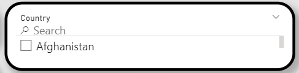
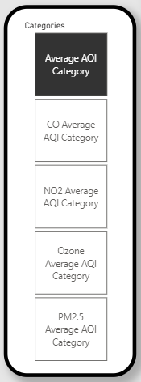
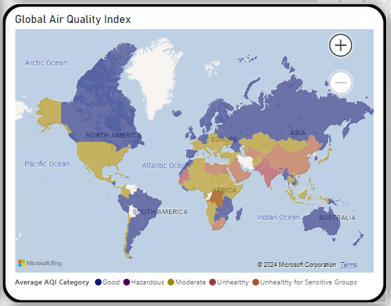
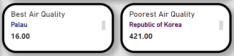
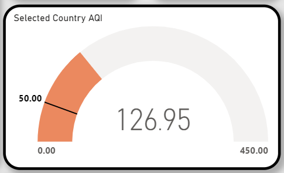
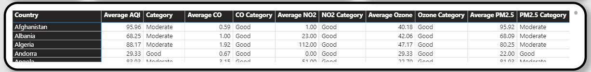

# Global-Air-Pollution-2022-Dashboard


The purpose of this dashboard is to allow users to delve deeper into global air pollution data. The dashboard is built around a dataset downloaded from Kaggle, titled: 'Global Air Pollution Dataset 2022', which detailed that the data was sourced from elichens. This dataset file can be found above in the repository.

This dashboard allows you to see the average air quality index (AQI) of countries across the world, as well as look into specific pollutants, such as CO and NO2.

## I have included visuals on the following variables:

- Interactive world map
- Information Table
- Air Quality Gauge
- Best / Worst air quality countries

## I have also included filters on the page to help narrow your search. These include:

- Country Search Bar
- Pollutant Category Toggle

## I created the following calculated columns that are used in many of the visuals:

- Average AQI
- Average AQI Category
- CO Average AQI Category
- CO Country Average
- NO2 Average AQI Category
- NO2 Country Average
- Ozone Average AQI Category
- Ozone Country Average
- PM2.5 Average AQI Category
- PM2.5 Country Average

Creating these calculated columns was necessary because the initial dataset contained measurements specific to cities within countries, meaning countries had multiple readings. For my dashboard I wanted to show the average readings for countries, and so I made these calculated columns to take an average for each country.

I have included the code for each of these columns below.

## Average AQI

```
Average AQI = CALCULATE(
  AVERAGE('global air pollution dataset'[AQI Value]),
  ALLEXCEPT('global air pollution dataset','global air pollution dataset'[Country])
)
```
This column calculates an average AQI value for each country. The ALLEXCEPT function ensures in this case that the only filter being applied to the data is the 'Country' filter. This calculation therefore takes of all the readings for 1 country and returns an average. 

## Average AQI Category

```
Average AQI Category =
SWITCH(
  TRUE(),
  'global air pollution dataset'[Average AQI] <= 50, "Good",
  'global air pollution dataset'[Average AQI] <= 100, "Moderate",
  'global air pollution dataset'[Average AQI] <= 150, "Unhealthy for Sensitive Groups",
  'global air pollution dataset'[Average AQI] <= 200, "Unhealthy",
  'global air pollution dataset'[Average AQI] <= 300, "Very Unhealthy",
  "Hazardous"
)
```
This column takes the average AQI number calculated in the previous code and then assigns it into a category based on the outlined conditions. In this way we are able to assign an average group to each country, rather than having multiple categories for each country at the city level.

The following expressions are all the same as the 2 above which I have just discussed, however they deal with specific pollutants. I will include the code below but will not include any further descriptions.

## CO Country Average
```
CO Country Average = CALCULATE(
  AVERAGE('global air pollution dataset'[CO AQI Value]),
  ALLEXCEPT('global air pollution dataset','global air pollution dataset'[Country])
)
```
## CO Average AQI Category
```
CO Average AQI Category =
SWITCH(
  TRUE(),
  'global air pollution dataset'[CO Country Average] <= 50, "Good",
  'global air pollution dataset'[CO Country Average] <= 100, "Moderate",
  'global air pollution dataset'[CO Country Average] <= 150, "Unhealthy for Sensitive Groups",
  'global air pollution dataset'[CO Country Average] <= 200, "Unhealthy",
  'global air pollution dataset'[CO Country Average] <= 300, "Very Unhealthy",
  "Hazardous"
)
```
## NO2 Country Average
```
NO2 Country Average = CALCULATE(
  AVERAGE('global air pollution dataset'[NO2 AQI Value]),
  ALLEXCEPT('global air pollution dataset','global air pollution dataset'[Country])
)
```
## NO2 Average AQI Category
```
NO2 Average AQI Category =
SWITCH(
  TRUE(),
  'global air pollution dataset'[NO2 Country Average] <= 50, "Good",
  'global air pollution dataset'[NO2 Country Average] <= 100, "Moderate",
  'global air pollution dataset'[NO2 Country Average] <= 150, "Unhealthy for Sensitive Groups",
  'global air pollution dataset'[NO2 Country Average] <= 200, "Unhealthy",
  'global air pollution dataset'[NO2 Country Average] <= 300, "Very Unhealthy",
  "Hazardous"
)
```
## Ozone Country Average
```
Ozone Country Average = CALCULATE(
  AVERAGE('global air pollution dataset'[Ozone AQI Value]),
  ALLEXCEPT('global air pollution dataset','global air pollution dataset'[Country])
)
```
## Ozone Average AQI Category
```
Ozone Average AQI Category =
SWITCH(
  TRUE(),
  'global air pollution dataset'[Ozone Country Average] <= 50, "Good",
  'global air pollution dataset'[Ozone Country Average] <= 100, "Moderate",
  'global air pollution dataset'[Ozone Country Average] <= 150, "Unhealthy for Sensitive Groups",
  'global air pollution dataset'[Ozone Country Average] <= 200, "Unhealthy",
  'global air pollution dataset'[Ozone Country Average] <= 300, "Very Unhealthy",
  "Hazardous"
)
```
## PM2.5 Country Average
```
PM2.5 Country Average = CALCULATE(
  AVERAGE('global air pollution dataset'[PM2.5 AQI Value]),
  ALLEXCEPT('global air pollution dataset','global air pollution dataset'[Country])
)
```
## PM2.5 Average AQI Category
```
PM2.5 Average AQI Category =
SWITCH(
  TRUE(),
  'global air pollution dataset'[PM2.5 Country Average] <= 50, "Good",
  'global air pollution dataset'[PM2.5 Country Average] <= 100, "Moderate",
  'global air pollution dataset'[PM2.5 Country Average] <= 150, "Unhealthy for Sensitive Groups",
  'global air pollution dataset'[PM2.5 Country Average] <= 200, "Unhealthy",
  'global air pollution dataset'[PM2.5 Country Average] <= 300, "Very Unhealthy",
  "Hazardous"
)
```
Now that the main calculated columns have all been explained, I will go on to show how I used these to create the dashboard visuals.

# Country Search Bar



The Search bar is a slicer with 'Country' dragged into the fields section, and the 'search' function activated.

# Pollutant Category Toggle



for this visual I created a field parameter using the calculated category columns we discussed above. I added  the following fields to the parameter:

- Average AQI Category
- CO Average AQI Category
- NO2 Average AQI Category
- Ozone Average AQI Category
- PM2.5 Average AQI Category

I then created a slicer for this parameter, set to the tiles option.

Clicking an option on this toggle will update all other visuals to show information specific to a particular pollutant.

# Interactive World Map



For the world map, I used a filled map visual and dragged 'Country' into the location field.

I then used the field parameter that I created for the pollutant category toggle and dragged it to both the legend and the tooltips fields. Additionally I dragged all of the average number columns I had created to the tooltips field, so that by hovering the mouse over a specific country, all the relevant AQI information will be given.

The country column is therefore 'mapped' to the visual and it the legend displays the different categories as different colours.

# Air Quality Cards



These 2 cards show the best and worst air quality from the dataset.

Best Air Quality: Country and MINIMUM(Average AQI)
Worst Air Quality: Country and MAXIMUM(Average AQI)

# AQI Gauge



The gauge visual displays the Average AQI numbers in a different way.

Selecting a country will populate the visual with it's Average AQI number. The target number of 50 is the maximum AQI score you can have while remaining in the 'Good' category. 

Countries with an AQI score greater than 50 will exceed this number, and the colour of the visual will change accordingly.

To set this visual up I created the following measure:

```
Selected Country AQI =
IF(
  HASONEVALUE('global air pollution dataset'[country]),
  AVERAGE('global air pollution dataset'[AQI Value]),
  BLANK()
)
```

This measure tells the visual to display the average AQI value of a country, but only if 1 country is selected. if no, or multiple, countries are selected the gauge will display nothing (blank).


# Main Information Table



The main information table includes all of the pollutant and category information in an easy to read format.

Country is assigned to the rows and then the average pollutant scores and categories are given as the values.

# Conclusion

In conclusion, I present a fully interactive dashboard that should make it easy for a user to investigate global air pollution trends.

Potential improvements or ways to take this further could include incorporating the city data alongside thee country data, allowing for a further in depth analysis of the regions of each country.
